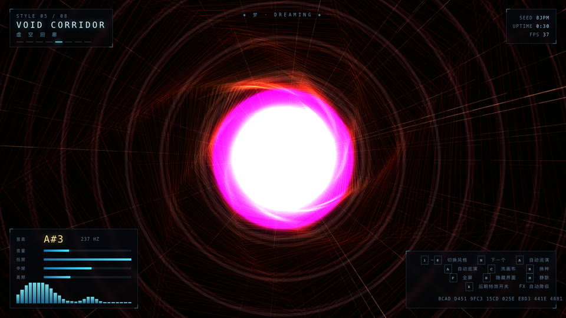
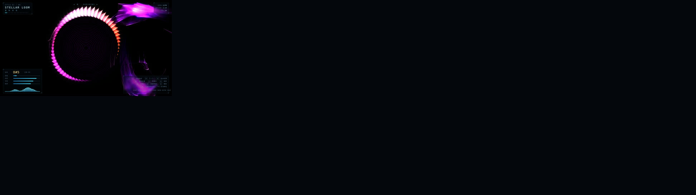
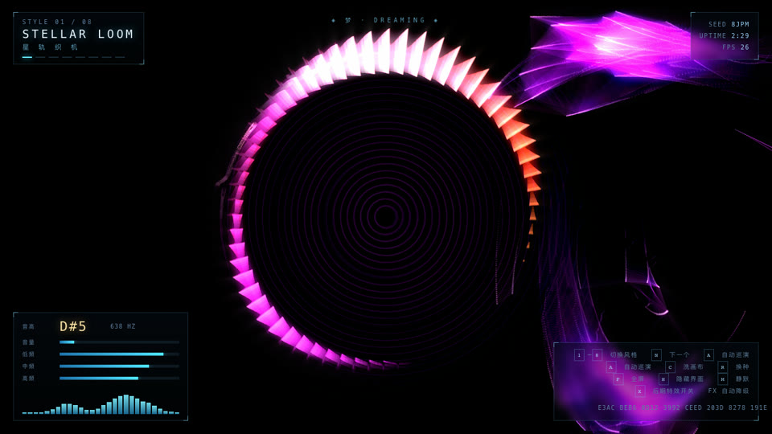
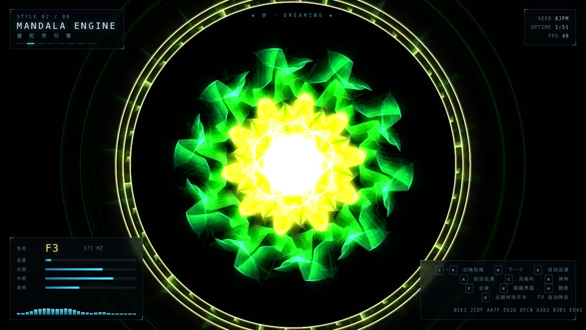
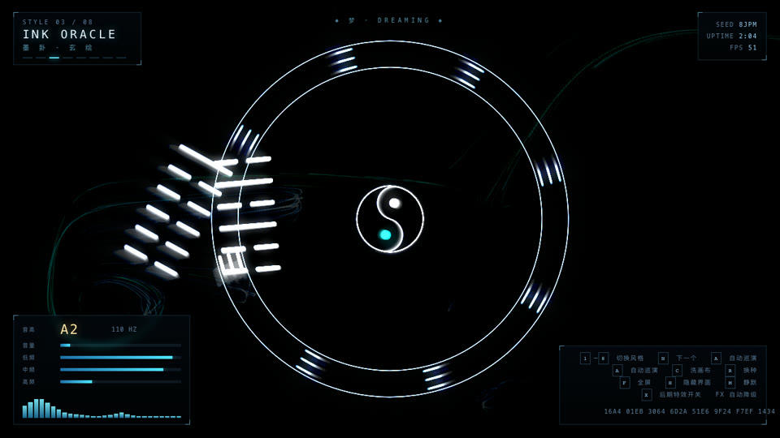
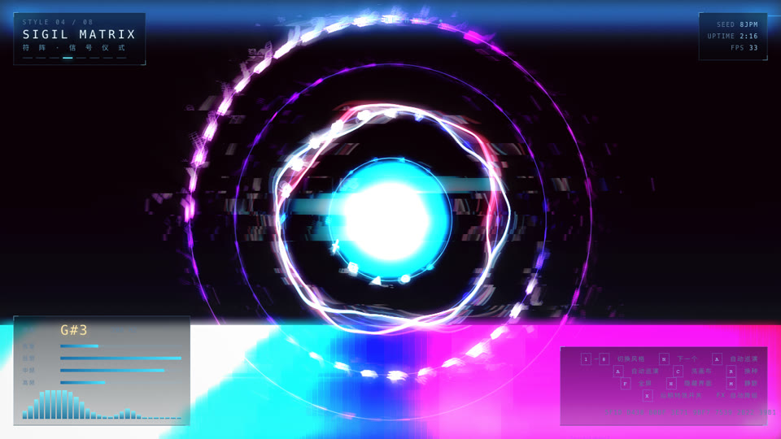
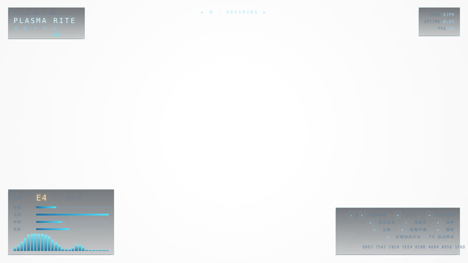
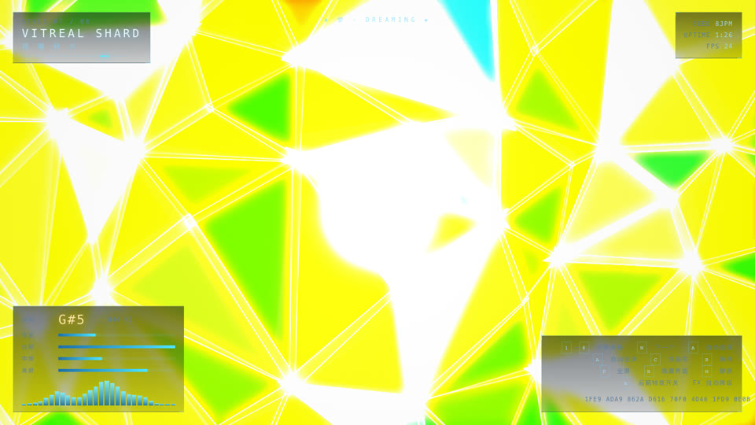
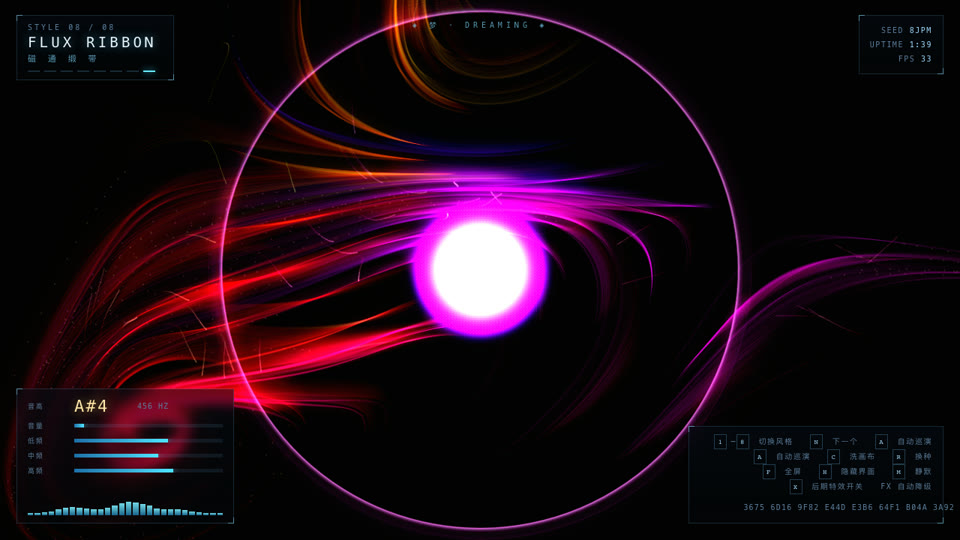

# VOID SCRIBE · 声之绘

**中文** | [English](#english)



> 用声音作画的活体屏保：麦克风驱动的无限画布生成艺术。开口就有回应，安静时也不停。
> A living screensaver that paints with sound — an infinite generative canvas driven by your microphone.

[](LICENSE)
[](#快速开始)
[](#技术栈)
[](#八种风格)

**已验证 Verified:** 8 种风格各连续渲染 120 帧无异常，JS 逻辑开销 0.26 – 1.10 ms/帧（1920×1080，不含 GPU 光栅化）。

---

## 这是什么

一个 **单文件 HTML 屏保**。打开它，授权麦克风，然后对着它说话、唱歌、敲桌子、吹气——画面会以你没见过的方式回应你。

它不是"音量越大越亮"那种糊弄。它真的在分析你的声音：

| 提取的特征 | 算法 | 驱动什么 |
|---|---|---|
| 音量 | 时域 RMS + 自动增益 AGC | 笔触轻重、辉光强度、拖尾长度、推进速度 |
| 音高 | 60–1600 Hz 谱峰 + 抛物线插值 | 色相冷暖、对称阶数、回廊截面边数、Chladni 模态 |
| 明亮度 | 谱质心（对数映射） | 色彩漂移、墨色、扭转量 |
| 频段能量 | 次低/低/中/高/空气 5 段 | 连线半径、涡流强度、环半径、裂纹开合 |
| 冲击力 | 谱通量 + 自适应阈值 onset | 声波环、墨爆、故障切片、冲击波、相机震动 |
| 频谱 | 4096 点 FFT → 64 个对数 bin | 花瓣起伏、符文亮度、径向条、缎带宽度 |
| 波形 | 2048 点时域 | 环形示波器、水面涟漪注入 |

**安静时它不会停下。** 音量低于阈值 1.5 秒后，画面平滑过渡到「梦境模式」——由多个不可通约频率（0.211 / 0.0471 / 0.0713 Hz……）叠加的呼吸曲线 + 三维噪声驱动，数学上永不循环。麦克风被拒绝也能照常运行。

## 为什么值得用

- **反馈是即时的、成体系的。** 音量、音高、频谱、起音四个维度各自驱动不同的视觉参数，所以你"做"出来的东西每次都不一样，而且你能学会控制它。
- **安静时也好看。** 大多数音频可视化没声音就是一片死黑。这个不是。
- **永不重复。** 噪声驱动的相机漂移永不回到原点，粒子在屏幕空间环绕接缝不可见，梦境模式的驱动频率互不通约。
- **没有一个外部依赖。** 一个 HTML 文件，双击就跑，可以离线、可以塞进 U 盘、可以直接丢给朋友。

## 核心能力

| 能力 | 用户得到什么 |
|---|---|
| 8 套可切换视觉风格 | 从赛博星图到 Chladni 驻波到琉璃碎裂，每种都是独立的视觉语言 |
| 实时后期处理链 | 回声隧道 / 泛光 / 色散 / 冲击波折射 / 相机震动 / 起音白闪 |
| 梦境模式 | 无声音时自主演化，永不静止、永不循环 |
| 自动巡演 | 默认每 55 秒自动换风格，可以挂在屏幕上当纯屏保 |
| 长曝光拖尾 | 安静时拖尾长、响亮时变利落，画面自带"呼吸感" |
| 帧率守护 | 掉到 40 fps 以下自动降级后期，回到 56 fps 自动恢复 |
| 全屏 + 息屏锁 | 支持全屏和 Screen Wake Lock，鼠标静止 6 秒自动隐藏界面与光标 |

## 八种风格



| # | 风格 | 声音怎么驱动它 |
|---|---|---|
| 01 | **STELLAR LOOM** 星轨织机 | 星点沿 curl 流场漂移；低频撑开连线半径织出星座网，音高推色相（青→品红），径向频谱环随声音生长，起音打出扩散声波环 |
| 02 | **MANDALA ENGINE** 曼陀罗引擎 | **音高直接决定对称阶数（6→20 重对称）**；5 层花瓣以不可通约速度反向旋转，每层轮廓由频谱实时塑造，起音闪现完整法印 |
| 03 | **INK ORACLE** 墨卦 | 900 条墨线在涡流中沉积；音高控制墨色（青→金），频谱改变湍流强度；外圈八卦随音高点亮，中心太极随音量加速，起音甩出墨爆并浮现六爻卦象 |
| 04 | **SIGIL MATRIX** 符阵 | 四重符文环亮度 = 频谱能量；环形示波器画双层反相波形；底部滚动频谱瀑布；起音对自身像素做水平位移的故障切片 |
| 05 | **VOID CORRIDOR** 虚空回廊 | 30 个环沿 z 轴飞来，`半径 = R/z` 透视投影；音量 = 推进速度，音高 = 回廊截面边数，起音从灭点炸出闸门冲击环 |
| 06 | **PLASMA RITE** 等离子仪轨 | 二维阻尼波动方程 + Chladni 驻波模态驱动；**音高决定模态阶数 n×m**，起音像投石一样注入涟漪，节线发光形成真实的克拉德尼图形 |
| 07 | **VITREAL SHARD** 琉璃碎片 | 抖动网格三角化成教堂彩窗碎裂面；音量撑开裂缝，频谱决定每片的颜色与位移，起音炸出一圈扩散的裂纹波 |
| 08 | **FLUX RIBBON** 磁通缎带 | 沿 curl 场积分出 115 条流线，做成纺锤形缎带；音量 = 流速，音高 = 色相，频谱 = 缎带宽度，起音拉伸流线 |

<details>
<summary>单张实拍图</summary>

| 01 星轨织机 | 02 曼陀罗引擎 |
|---|---|
|  |  |
| 03 墨卦 | 04 符阵 |
|  |  |
| 05 虚空回廊 | 06 等离子仪轨 |
|  |  |
| 07 琉璃碎片 | 08 磁通缎带 |
|  |  |

</details>

## 快速开始

### 最快路径

1. 下载 `index.html`
2. 双击用 Chrome / Edge / Safari / Firefox 打开
3. 点「◈ 开 始 通 灵 ◈」，允许麦克风
4. **对它说话**

```bash
# 或者直接克隆
git clone https://github.com/joeseesun/void-scribe.git
cd void-scribe
open index.html
```

<details>
<summary>手动安装 / 高级配置</summary>

如果需要麦克风权限正常工作，浏览器要求**安全上下文**。以下方式都可以：

```bash
# 方式一：本地 HTTP（推荐，权限行为最标准）
cd void-scribe
python3 -m http.server 8000
# 然后打开 http://localhost:8000
```

```bash
# 方式二：直接用 file:// 打开
# Chrome / Edge / Firefox 把 file:// 视为安全上下文，麦克风可用
open index.html
```

> 如果被拒绝授权，程序不会崩——它会自动进入「梦境模式」，画面照样自主演化。

**用 URL hash 直达某个风格**（方便分享 / 演示）：

```
index.html#6     # 直接打开「等离子仪轨」
index.html#8     # 直接打开「磁通缎带」
```

</details>

## 使用方式

| 按键 | 作用 |
|---|---|
| `1` – `8` | 直接切换到对应风格 |
| `N` | 下一个风格 |
| `A` | 自动巡演开关（默认开，55 秒一换） |
| `C` | 洗画布（快速清除拖尾） |
| `R` | 换新种子，重掷全部粒子 |
| `X` | 后期特效总开关（关闭可显著提升低端机帧率） |
| `F` / 双击 | 全屏切换 |
| `H` | 显示 / 隐藏界面 |
| `M` | 静默（强制退回梦境模式） |

鼠标静止 6 秒后 HUD 和光标会自动隐藏，动一下就回来。

## 工作流 / 原理

```
麦克风 → Web Audio AnalyserNode
          ├─ 频域 FFT 4096 → 64 个对数 bin → 频谱 / 质心 / 频段 / 谱通量
          └─ 时域 2048     → RMS 音量 / 波形
                              ↓
                    特征融合（真实 ⇄ 梦境，按"是否在说话"平滑插值）
                              ↓
              相机（噪声漂移 + 旋转 + 呼吸缩放 + 起音推镜 + 震动）
                              ↓
        场景离屏缓冲：长曝光拖尾 → 风格世界绘制 → 风格屏幕层
                              ↓
        合成到可见画布 → 后期处理链
                              ↓
       回声隧道 → 泛光 + 色散 → 冲击波折射 → 起音白闪 → 暗角 → 颗粒
```

**无限画布靠三件事**：长曝光拖尾（安静时拖尾长、响亮时变利落）、噪声驱动的相机漂移（永不回原点）、粒子在屏幕空间环绕（流场随相机滚动，接缝不可见）。

**梦境模式**由多个不可通约频率叠加的呼吸曲线 + 三维值噪声驱动，并包含泊松分布的"幽灵起音"，所以既永不循环，也不会看起来像匀速播放的动画。

**泛光为什么不会白屏**：场景先画进离屏缓冲，泛光和回声读的都是**未经后期**的那一版，反馈闭环被打断。同时拖尾衰减会随风格的回声强度自动加快，避免持续区域累积过曝。

## 技术栈

- 原生 Canvas 2D（无 WebGL、无 three.js、无构建步骤）
- Web Audio API：`AnalyserNode` × 2（频域 + 时域）
- `getUserMedia` 麦克风采集（关闭回声消除 / 噪声抑制 / 自动增益，要原始信号）
- 自写三维值噪声 + fbm + curl 流场网格 + 双线性采样
- Canvas `filter` 做亮部提取与模糊（不支持的浏览器会优雅降级为无模糊的加色辉光）
- Screen Wake Lock API（可选）

零依赖、零构建、单文件，1818 行。

## 项目结构

```
void-scribe/
├── index.html            # 全部内容：样式、逻辑、渲染、后期，单文件
├── assets/               # 八种风格的实拍图与相册
│   ├── gallery.jpg           # 4×2 接触印相
│   ├── social-preview.jpg    # GitHub 社交预览图
│   └── style-*.jpg           # 每种风格单张实拍
├── LICENSE               # MIT
└── README.md
```

## 实测验证

冒烟测试：对 Canvas 2D / DOM 打桩后，在 Node 中驱动主循环，8 种风格各连续渲染 120 帧，无异常抛出，JS 逻辑开销如下（1920×1080，不含 GPU 光栅化）：

```
style 1 STELLAR LOOM     120 frames OK   0.94 ms/frame
style 2 MANDALA ENGINE   120 frames OK   0.60 ms/frame
style 3 INK ORACLE       120 frames OK   1.10 ms/frame
style 4 SIGIL MATRIX     120 frames OK   0.33 ms/frame
style 5 VOID CORRIDOR    120 frames OK   0.30 ms/frame
style 6 PLASMA RITE      120 frames OK   0.52 ms/frame
style 7 VITREAL SHARD    120 frames OK   0.26 ms/frame
style 8 FLUX RIBBON      120 frames OK   1.08 ms/frame
```

`assets/` 中的八张实拍图是在真实 Chromium 中逐一运行各风格、等待画面累积后截取的实际帧，非设计稿。

**尚未在 Windows / Linux 桌面浏览器上实测**，仅依赖标准 Web API，理论上无平台差异。

## 限制、隐私与边界

- **音频 100% 留在本地。** 没有网络请求、没有上传、没有录音、没有持久化；`AnalyserNode` 读完即弃。
- **需要麦克风权限。** 被拒绝时自动降级为梦境模式，功能完整但不再响应声音。
- **不是托管服务。** 没有任何后端、账号、 telemetry。
- **不支持移动端自动全屏**（iOS Safari 限制），需要手动点全屏按钮。
- **`ctx.filter` 在较老的 Safari 上不支持**，此时泛光会退化为无模糊的加色辉光，画面依然成立。
- **性能**：默认 DPR 上限 1.6。4K / 5K 屏上如果掉帧，按 `X` 关闭后期特效，或按 `H` 隐藏 HUD 后全屏。
- 分享或二次分发时请保留 `LICENSE` 与作者署名。

## 关于向阳乔木

由 向阳乔木 用 AI 辅助构建。

- 网站：[qiaomu.ai](https://qiaomu.ai)
- 博客：[blog.qiaomu.ai](https://blog.qiaomu.ai)
- 推荐：[tuijian.qiaomu.ai](https://tuijian.qiaomu.ai)
- X：[@vista8](https://x.com/vista8)
- GitHub：[@joeseesun](https://github.com/joeseesun)
- 微信公众号：向阳乔木推荐看

欢迎提 issue 和 PR。这是一个"小而完整"的作品，不追求变成大项目。

---

<a name="english"></a>

# English

**English** | [中文](#void-scribe--声之绘)


> A living screensaver that paints with sound — an infinite generative canvas driven by your microphone.

## What it is

A **single-file HTML screensaver**. Open it, grant microphone access, then talk, sing, tap the desk, or blow at it — the canvas answers back.

It does not fake it with "louder = brighter". It actually analyses the signal:

| Feature | Method | Drives |
|---|---|---|
| Volume | time-domain RMS + AGC | stroke weight, glow, trail length, travel speed |
| Pitch | 60–1600 Hz spectral peak + parabolic interpolation | hue, symmetry order, corridor cross-section, Chladni mode |
| Brightness | spectral centroid (log-mapped) | colour drift, ink tone, twist |
| Band energy | sub / low / mid / high / air | link radius, turbulence, ring radius, crack opening |
| Impact | spectral flux + adaptive threshold onset | shock rings, ink bursts, glitch slices, shockwave, camera shake |
| Spectrum | 4096-pt FFT → 64 log bins | petal contour, glyph brightness, radial bars, ribbon width |
| Waveform | 2048-pt time domain | radial oscilloscope, ripple injection |

**It never stops when you are quiet.** 1.5 seconds below the volume threshold, the piece crossfades into **Dream Mode** — driven by breathing curves built from mutually irrational frequencies (0.211 / 0.0471 / 0.0713 Hz …) plus 3D value noise, so it provably never loops. Denying microphone permission still leaves a fully working piece.

## Try it in under a minute

```bash
git clone https://github.com/joeseesun/void-scribe.git
cd void-scribe
open index.html          # or: python3 -m http.server 8000
```

1. Click **◈ 开 始 通 灵 ◈** (Begin).
2. Allow microphone access.
3. **Talk to it.**

Press `1`–`8` to switch styles, `A` toggles auto-cycling, `X` turns post-processing off, `F` goes fullscreen.

## Eight styles


| # | Style | How sound drives it |
|---|---|---|
| 01 | **STELLAR LOOM** | Nodes drift on a curl-noise field; bass widens the constellation link radius, pitch pushes hue cyan→magenta, onsets emit expanding shock rings |
| 02 | **MANDALA ENGINE** | **Pitch sets the symmetry order (6→20-fold)**; 5 petal layers counter-rotate at irrational rates, contours shaped live by the spectrum |
| 03 | **INK ORACLE** | 900 ink strokes settle in a vortex; pitch sets ink tone, spectrum sets turbulence; a rotating bagua lights by pitch, the taiji spins with volume |
| 04 | **SIGIL MATRIX** | Four glyph rings lit by spectrum energy, dual-phase radial oscilloscope, scrolling spectrogram, onsets slice the frame with glitch displacement |
| 05 | **VOID CORRIDOR** | 30 rings fly at you with `radius = R/z` perspective; volume = travel speed, pitch = cross-section sides, onsets fire gate rings from the vanishing point |
| 06 | **PLASMA RITE** | A damped 2D wave equation driven by Chladni modes; **pitch picks the n×m mode**, onsets drop ripples, nodal lines glow into real Chladni figures |
| 07 | **VITREAL SHARD** | Jittered-grid triangulation into stained-glass shards; volume opens the cracks, spectrum tints and displaces each shard, onsets blast a crack wave |
| 08 | **FLUX RIBBON** | 115 streamlines integrated along the curl field into spindle ribbons; volume = flow speed, pitch = hue, spectrum = ribbon width |

## Verified

Smoke-tested with a stubbed Canvas 2D / DOM in Node: all 8 styles rendered 120 consecutive frames with no exceptions, JS cost **0.26 – 1.10 ms/frame** at 1920×1080 (excluding GPU rasterisation). The eight images in `assets/` are real frames captured from Chromium after letting each style accumulate — not mockups.

## Limits, privacy, and boundaries

- **Audio never leaves the machine.** No network requests, no upload, no recording, no persistence — `AnalyserNode` data is read and discarded.
- **Microphone permission required.** Denied access degrades gracefully to Dream Mode.
- **Not a hosted service.** No backend, no accounts, no telemetry.
- **No mobile auto-fullscreen** (iOS Safari limitation); use the `F` key.
- **`ctx.filter` is unsupported on older Safari** — bloom degrades to an unblurred additive glow, still visually coherent.
- **Performance:** DPR capped at 1.6. On 4K/5K displays, press `X` to disable post-processing.
- **Not yet tested on Windows/Linux desktop browsers**; only standard Web APIs are used.

## License

MIT — see [LICENSE](LICENSE). Keep the license and attribution when redistributing.

Built by 向阳乔木 with AI assistance — [qiaomu.ai](https://qiaomu.ai) · [@vista8](https://x.com/vista8) · [@joeseesun](https://github.com/joeseesun)
